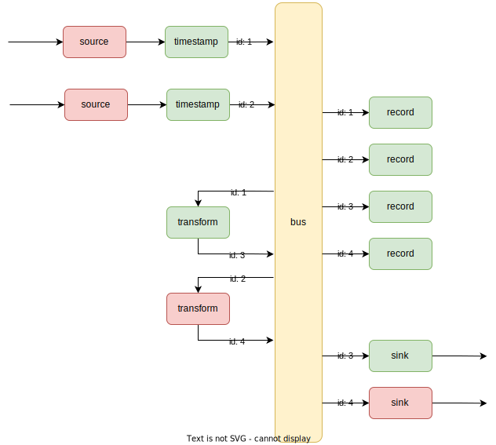

# porla
**P**ipeline-**O**riented **R**eal-time **L**ogging **A**ssistant or simply a basic toolbox for handling of line-based streaming data using linux pipes and some handy command-line utilities

> "porla" is also a Swedish word for the soothing sound of running water from a small stream of water

## Motivation and purpose

`porla` was conceived as a result of our needs with regards to data logging and data "proxying" in relation to different research projects. The framework had to be:

* Minimalistic, we needed something that was easy to reach for also for the smallest of tasks.
* Versatile, we needed something that we could use for many different setups where the base assumptions did not work against us.
* Configurable, we needed to be able to easily build data pipelines from scratch on-site ideally without resorting to re-building any software.
* Documentable, everything needed to be documentable so that any setup could be recreated as required.
* Non-invasive, we needed something that didnt require us to conform to any specific data format or programming language.
* Extensible, we needed it to be easily extensible as the inherent nature of research projects means we never know what the next thing will be.

With that said, `porla` is primarily designed for logging and proxying of line-based, textual data.


## Overview

### Schematic



### Tech stack

`porla` is built on top of three well-known technologies:

* Linux pipes
* UDP Multicast
* Containerization (Docker containers)

UDP Multicast is leveraged for the `bus` that is used to connect user-confgured `pipelines`, wherein Linux pipes are used to chain multiple commands. Each pipeline is contained within its own containerizied environment. Have a look at the `Examples` section further down.

### Performance

TODO

## Usage

It is packaged as a docker image, available here: [https://github.com/orgs/MO-RISE/packages](https://github.com/RISE-Maritime/porla/pkgs/container/porla)

The image expects a "run" command inputted on startup. Using docker run, this would manifest as such:
```
docker run --network=host porla "<command>"
```

Using docker-compose it would look like this:
```
version: '3'
services:
    service_1:
        image: ghcr.io/mo-rise/porla
        network_mode: host
        restart: always
        command: ["<command>"]
```

### Built-in functionality

* **to_bus** and **from_bus**

  Pipes data to or from the `bus`. Expects a single argument, the `bus_id`, which needs to be in the range 0-255. In addition, `to_bus` accepts the optional argument `--ttl` which can be used to set the TTL (Time-to-Live) of the outgoing multicast datagram, it defaults to `--ttl 0` (which constrains the traffic to the own host only).

* **record**

  Records (appends) data from STDIN to a file. Expects a single required argument, the `file_path`. Optionally accepts:
  - `--rotate-at` (a cron expression for when to rotate logs)
  - `--rotate-count` (number of rotated files to keep, defaults to 7)
  - `--date-format` (strftime format for rotated file dates, defaults to `-%Y%m%d`)

  The cron expression must have exactly 5 fields: minute, hour, day, month, and weekday (e.g., `'0 0 * * *'` for daily at midnight, `'*/15 * * * *'` for every 15 minutes). Rotated files are stored in a `historic` subdirectory next to the original log file, with the original file extension preserved (e.g., `historic/bus_id_1-20251118.log.gz`).

* **b64**

  Base64 encodes (`--encode`) or decodes (`--decode`) data from STDIN to STDOUT. Optinally takes two arguments, the `input_format_specification` and the `output_format_specification` to flexibly allow only parts of the input to be encoded/decoded.

* **jsonify**

  Parses each line according to a `parse` format specification (see https://github.com/r1chardj0n3s/parse#format-syntax) and outputs the named values as key-value pairs in a json object. Expects a single argument, the `format specification`.

* **timestamp**

  Prepends a timestamp  to each line. The timestamp is either the unix epoch (`--epoch`) or in rfc3339 format (`--rfc3339`)

* **shuffle**

  Rearrange, deduct or add content to each line using two (one for the input and one for the output) format specifications. Expects two arguments, the `input_format_specification` and the `output_format_specification`.

* **limit**

  Rate limit the flow through a pipe on a line-by-line basis. Expects a single required argument, `interval`, and an optional argument, `--key` with a format specification of how to find the key of each line whereby to "group" the flow.


### 3rd-party tools

* **socat**

  https://linux.die.net/man/1/socat

* **jq**

  https://jqlang.github.io/jq/manual/v1.7/

* **parallel**

  https://linux.die.net/man/1/parallel

### Examples

```yaml
version: '3.8'

services:
    source_1:
        image: ghcr.io/mo-rise/porla
        network_mode: host
        restart: always
        command: ["socat UDP4-RECV:1457,reuseaddr STDOUT | timestamp | to_bus 1"]

    transform_1:
        image: ghcr.io/mo-rise/porla
        network_mode: host
        restart: always
        command: ["from_bus 1 | jsonify '{} {name} {value}' | to_bus 2"]

    transform_2:
        image: ghcr.io/mo-rise/porla
        network_mode: host
        restart: always
        command: ["from_bus 2 | b64 --encode | to_bus 3"]

    sink_1:
        image: ghcr.io/mo-rise/porla
        network_mode: host
        restart: always
        command: ["from_bus 3 | socat STDIN UDP4-DATAGRAM:1458"]

    sink2:
        image: ghcr.io/mo-rise/porla
        network_mode: host
        restart: always
        command: ["from_bus 3 | to_bus 255 --ttl 1"]

    record_1:
        image: ghcr.io/mo-rise/porla
        network_mode: host
        restart: always
        volumes:
            - ./recordings:/recordings
        command: ["from_bus 1 | record /recordings/bus_id_1.log --rotate-at '0 0 * * *' --rotate-count 30 --date-format '-%Y-%m-%d'"]

    record_2:
        image: ghcr.io/mo-rise/porla
        network_mode: host
        restart: always
        volumes:
            - ./recordings:/recordings
        command: ["from_bus 2 | record /recordings/bus_id_2.log"]

    record_3:
        image: ghcr.io/mo-rise/porla
        network_mode: host
        restart: always
        volumes:
            - ./recordings:/recordings
        command: ["from_bus 3 | record /recordings/bus_id_3.log"]

```

## Extensions

Extensions to `porla` are simply other docker images, using the `porla` image as the base image, adding other binaries/command-line tools accessible to the end user. For examples, see https://github.com/topics/porla-extension

Generally, for convenience and to avoid confusion, extensions to `porla` should:
* be named as `porla-<extension-name>`
* add the topic `porla-extension` to the repository to be visible in

For a quick and easy start, use the [repository template](https://github.com/MO-RISE/porla-extension-template).
